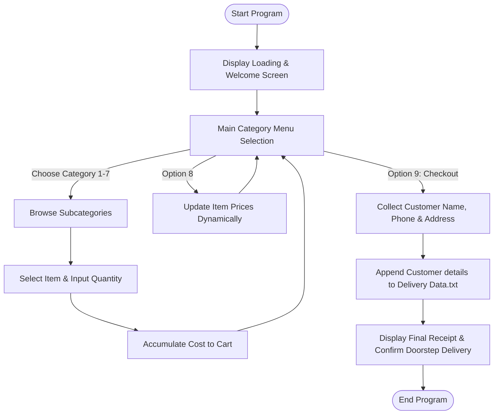

# 🍽️ Spice Delight: Restaurant Management System

A high-performance, interactive console application built in **C++** that automates menu browsing, order placement, dynamic price adjustments, and delivery billing processes.

---

## 📌 Table of Contents
1. [🌟 About the Project](#-about-the-project)
2. [✨ Key Features](#-key-features)
3. [🛠️ Technologies Used](#-technologies-used)
4. [📂 Project Structure](#-project-structure)
5. [📊 System Architecture & Working](#-system-architecture--working)
6. [📋 Detailed Menu & Initial Pricing](#-detailed-menu--initial-pricing)
7. [🎮 Step-by-Step Functionality](#-step-by-step-functionality)
8. [⚙️ Technical Implementation Details](#-technical-implementation-details)
9. [💾 File Handling & Persistence](#-file-handling--persistence)
10. [🚀 How to Run](#-how-to-run)
11. [👤 Authors & Contributors](#-authors--contributors)

---

## 🌟 About the Project

**Spice Delight** is a comprehensive, interactive command-line interface (CLI) application developed in C++. It simulates the front-of-house operations of a modern restaurant, offering users a fully structured dining categorization to browse, select quantities, customize prices dynamically, and generate formatted delivery invoices.

Designed for efficiency and visual feedback, the system incorporates custom animations, sound delays, terminal colors, and file persistence for order tracking.

---

## ✨ Key Features

* 📋 **Multi-Level Categorized Menu**: 7 major food categories subdivided into specific cuisines and local variations.
* 🛒 **Dynamic Cart & Bill System**: Keeps track of running subtotals, quantities, and calculates the final billing on checkout.
* ✏️ **Dynamic Price Modification**: Administrative capability to modify item prices in real-time during runtime.
* 👤 **Customer Information Input**: Prompts and validates delivery details from the customer prior to order finalization.
* 💾 **Data Persistence**: Records customer credentials and logs order details directly into an external database file (`Delivery Data.txt`).
* 🖥️ **Rich Console UX**: Uses Windows-specific API routines to control terminal colors, custom text typing speed delays (`Typetext`), and an interactive loading bar.

---

## 🛠️ Technologies Used

* 💻 **C++ Language**: Core business logic and menu manipulation.
* 🧱 **Object-Oriented Programming (OOP)**: Structured functions and separation of category concerns.
* 💾 **File Handling / Streams**: `std::fstream` implementation for database storage.
* 📺 **Windows API (`windows.h`)**: UI enhancements including `Sleep()` timers and terminal screen manipulation via `system()`.

---

## 📂 Project Structure

```text
RestaurantManagementSystem_CppProject/
│
├── .git/                               # Version control repository metadata
├── README.md                           # Documentation & system blueprint (this file)
├── Restaurant Management System.cpp    # Primary source code implementing the CLI application
├── Restaurant Managemnt System.sln     # Visual Studio solution file for MSVC compilers
└── Restaurant Mnagemnt System.avi      # Project video demonstration file
```

---

## 📊 System Architecture & Working

The application behaves as a state-machine that operates inside a cyclic loop:



---

## 📋 Detailed Menu & Initial Pricing

Below is the complete hierarchical menu system implemented in the codebase:

| Category | Sub-Category | Item Name | Initial Price (Rs.) |
| :--- | :--- | :--- | :--- |
| **1. Instant** | Noodles | Kolson Noodles | 150 |
| | | Knorr Noodles | 180 |
| | | Samyang Noodles | 200 |
| | Pasta | Vermicelli Pasta | 350 |
| | | Elbow Pasta | 500 |
| | | Spaghetti Pasta | 700 |
| | Chips | Pringles | 50 |
| | | Lays | 100 |
| | | Twisters | 150 |
| **2. Meat** | Chicken | Chicken Karahi (1kg) | 1,000 |
| | | White Meat (1kg) | 1,500 |
| | | Desi Karahi (1kg) | 1,700 |
| | Mutton | Mutton Korma | 2,000 |
| | | Mutton Nihari | 2,200 |
| | | Mutton Curry | 2,500 |
| | Beef | Beef Shanks | 3,000 |
| | | Beef Chucks | 3,200 |
| | | Beef Ribs | 3,500 |
| **3. Fish** | Boneless | Kala Paplet (1kg) | 1,500 |
| | | Cat Fish (Khagga) (1kg) | 2,000 |
| | | Croacker Mushka (1kg) | 2,500 |
| | Fish Cuts | Fillet Cuts | 1,000 |
| | | Lion Cuts | 1,500 |
| | | Tail Cuts | 2,000 |
| | Crustaceans | Crab | 3,000 |
| | | Cray Fish | 4,000 |
| | | Lobster | 4,500 |
| **4. Soup** | Soups | Cream Soup | 500 |
| | | Chowders Soup | 700 |
| | | Bisque Soup | 900 |
| **5. Cuisine** | Spaghetti | Spaghettini | 200 |
| | | Spaghettoni | 400 |
| | | Stringozzi | 500 |
| | Rice | Chicken Biryani | 250 |
| | | Chicken Pulao | 300 |
| | | Chinese Rice | 450 |
| | Chow Mein | Crispy Chow Mein | 350 |
| | | Steamed Chow Mein | 600 |
| | | Yaki-Soba Noodles | 700 |
| **6. Drinks** | Tea | Quetta Dudh Patti | 100 |
| | | Special Tea | 150 |
| | | Green Tea | 200 |
| | Cold Drinks | Regular (Pepsi, 7up, Mirinda, Sprite) | 100 |
| | | Sting | 100 |
| | | Red Bull | 500 |
| | Juices | Nestle Box Juice | 200 |
| | | Fresh Juice | 250 |
| | | Milk Shake | 250 |
| **7. Desserts** | Ice Cream | Tutti Frutti | 200 |
| | | Blue Berry | 250 |
| | | Choco Lava | 250 |
| | Pastries | Brownie | 150 |
| | | Dessert Pastry | 300 |
| | | Chocolate Pastry | 500 |
| | Home Made | Kheer Mix | 300 |
| | | Custard | 400 |

---

## 🎮 Step-by-Step Functionality

Here is a detailed guide on how each functional module runs:

### 1️⃣ Welcome & Loading Animation
* **Action**: Displays a visual loading progress bar utilizing custom ASCII characters (`█`) and a delayed rendering engine to build suspense.
* **Credits**: Highlights developer credentials with typewriter animation delays.

### 2️⃣ Main Interactive Menu
* **Navigation**: Features 9 options, dynamically rendered with a customized light blue background palette (`system("color B0")`).
* **Selection**: Users type integer keys `1` to `9` to enter menus, modify configurations, or checkout.

### 3️⃣ Interactive Ordering & Submenus
* **Item Choices**: Once a category is chosen, submenus show up with current real-time prices.
* **Quantity Input**: Prompts the user to specify quantities (e.g., `2` plates of Biryani).
* **Running Subtotals**: Calculates subtotal instantly, prompting if they want to add more items (`y/n`) or display the bill.

### 4️⃣ Administrative Price Customization
* **Selection**: Option `8` triggers a secure price configuration interface.
* **Mechanism**: The user navigates category ➡️ subcategory ➡️ specific item index, inputs a new price, and overrides the global array instantly.
* **Application**: All subsequent item orders will immediately reflect the updated pricing values.

### 5️⃣ Checkout & Order Persistence
* **Personal Information**: Collects customer **Name**, **Phone Number**, and **Address**.
* **Confirmation Loop**: Prompts user validation (`y/n`) to confirm correct delivery details before checkout.
* **Invoice Output**: Clears screen, changes layout color to Red/Yellow (`system("color CE")`), generates a total checkout bill, and logs it to disk.

---

## ⚙️ Technical Implementation Details

The program makes active use of the following native C++ paradigms and system APIs:

* **Custom Text Type-Writer Transition (`Typetext`)**:
  Slows down text rendering to create retro terminal-style outputs using thread sleeping.
  ```cpp
  void Typetext(const string& text, int delayMilliSeconds) {
      for (char c : text) {
          cout << c;
          Sleep(delayMilliSeconds);
      }
  }
  ```
* **Console Controls (`windows.h`)**:
  Uses `system("cls")` and `system("color [Attr]")` to clear the terminal screen and change background/foreground color palettes on various screens (e.g. Welcome screen uses `03` Cyan, Main menu uses `B0` Light Gray/Black, and billing screens use `CE` Red/Yellow).
* **Dynamic Arrays**: Menu pricing structures are mapped to globally shared floating-point arrays (`Noodles_Price`, `Pasta_Price`, etc.) allowing instant lookup, modification, and multiplication against quantity multipliers.

---

## 💾 File Handling & Persistence

When checking out (Option 9), the program requests the user's contact information. This information is processed through the file stream system and appended directly to `Delivery Data.txt` in the root executable directory:

```cpp
fstream file;
file.open("Delivery Data.txt", ios::app);
// Writes data using stream insertion operators
file << "Name: " << name << endl;
file << "Phone Number: " << phoneNumber << endl;
file << "Address: " << address << endl;
file.close();
```

---

## 🚀 How to Run

### Prerequisites
* **Operating System**: Windows (uses `windows.h` headers for colors and thread sleeping)
* **Compiler**: C++11 or higher (GCC / MinGW / MSVC)

### Terminal Compilation
```bash
# Compile the C++ file
g++ -std=c++11 "Restaurant Management System.cpp" -o RestaurantSystem.exe

# Execute the application
./RestaurantSystem.exe
```

### IDE Integration
You can compile and run directly through C++ IDEs such as:
* **Visual Studio** (Open the provided `Restaurant Managemnt System.sln` solution file)
* **Code::Blocks** or **Dev-C++** (Create a console project and add `Restaurant Management System.cpp` to the build path)

---

## 👤 Authors & Contributors

Developed and Maintained by:
* **Hamza Masood** (Lead Developer)
* **Areeza Maryam** (Team Member)
* **Rubab Hanif** (Team Member)
